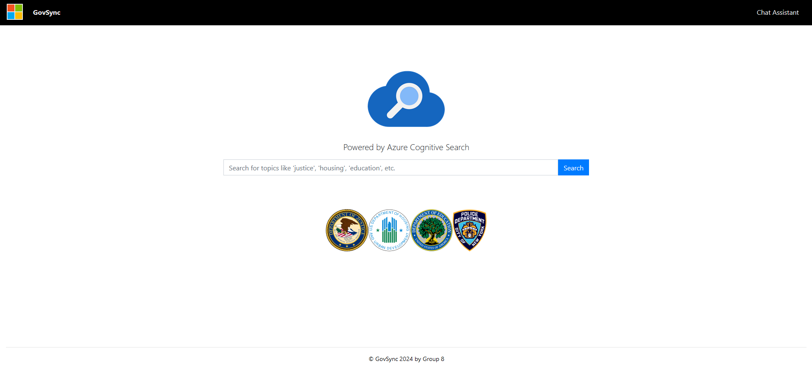

# GovSync

GovSync is a knowledge management system designed to facilitate cross-agency collaboration and evidence-based decision-making. It leverages public datasets and Azure Cognitive Services to provide a user-friendly interface for searching, retrieving, and sharing relevant knowledge across government agencies.
## Features

- Powerful full-text search capabilities
- User-friendly interface for easy navigation
- Chat with availeble data to gain meaningfull insight
- Share data for cross agancy collaberation  

You can view the resulting web application here: https://witty-field-015c08f0f.5.azurestaticapps.net/

## Architecture

The GovSync platform is built using a microservices architecture, leveraging various Azure services. The main components of the architecture include:

- Azure AI Search: Utilized for advanced search capabilities.
- Azure Static Web App: Hosts the user-friendly interface and provides seamless deployment and scaling capabilities.
- Azure Blob Storage: Stores the datasets used by GovSync, ensuring secure and reliable data storage.
- Azure Functions: Enables serverless computing for handling backend processes and integrating with other services.

By utilizing this architecture, GovSync ensures scalability, reliability, and efficient data processing, enabling seamless collaboration and decision-making across government agencies.

## Built With

* [Azure AI Search](https://learn.microsoft.com/en-us/azure/search/search-what-is-azure-search)
* [Azure Static Web App](https://azure.microsoft.com/en-us/products/app-service/static)
* [Azure Azure Blob Storage](https://azure.microsoft.com/en-us/pricing/details/storage/blobs/)
* [Azure Functions](https://azure.microsoft.com/en-us/products/functions/)

